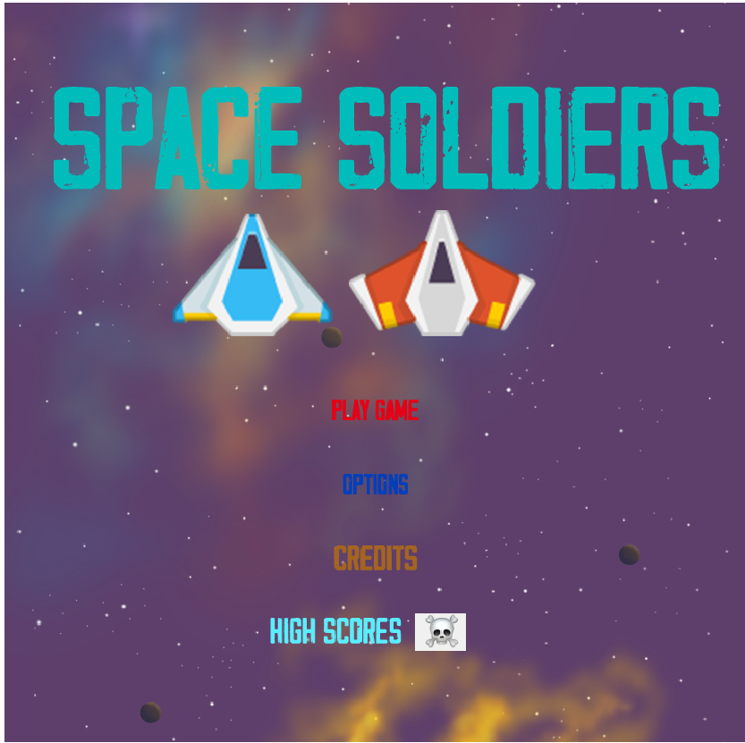

# Capstone-space-shooter-game-js

I built this game as part of the Final Project for JavaScript Section at Full-Stack Developer Programm at Microverse School. This is a full JavaScript app about a space shooter game.
I implemented this game using Phaser 3 as the main dependency for the game.
The scores of each player are saved and displayed using an API services.

I use npm and webpack to compile files and assets.
Also, I use Jest to test the functions created in this game.

## Game Controls (How to play)

For how to play the game locally please go to the **Getting Started Section** or if you want to play in your browser with one single click open the link given in the **Live Demo Link Section.**

Every time you enter the game for the first time, you will be asked to put your name. 
Type your name in the line of the input and then click on the ACCEPT button down below.

**To move around with the ship, use the W, A, S, D keys and to shoot at enemies using the SPACE key.**

**Destroy as many enemies as possible and get the high scores ever!**

## Built With

- JavaScript
- Webpack
- Phaser 3
- Babel
- Gh-pages
- Jest
- Phaser regenerator-runtime

### Linters Used

- Eslint
- Stylelint

All assets as images, sounds and music from OpenGameArt.org.
You can see all the arts for this game at this link:

[Project Assets](https://opengameart.org/content/space-shooter-redux)

## Live Demo - Try the game here

[Live Demo Link](https://alejandrotoledoweb.github.io/capstone-space-shooter-game-js/)

## Getting Started

To get a local copy up and follow these simple example steps.

### Prerequisites

- Local Machine installed [Nodejs](https://nodejs.org/en/download/)
- Npm as a package manager
- A code editor as [Visual Studio](https://code.visualstudio.com/download), Sublime,etc.

### Setup

- Please make a local copy of this repo by typing this command on your terminal.

`git clone https://github.com/alejandrotoledoweb/capstone-space-shooter-game-js.git`

- Then, go to the folder created with:

`cd capstone-space-shooter-game-js`

### Install

- In order to install all dependencies and assets please run this command:

`npm install`

Now that you have everything installed you need to compile everything:

`npm run build`

### Usage

Now for the usage, you just need to go to the `dist` folder inside the repo and open the `index.html` with the live server of your choice.

You will see that your web browser open a tab and then the game is playable.

### Alternative for using the game in a local environment

After installing all the dependencies with `npm install`, you can run the command `npm run start`, with this, you will compile the code and the game will be ready to play opening the browser with this address. `http://localhost:9000`.

### Run tests

To run the test implemented for the game, please run this command:

`npm run test`

### Deployment

The app is deployed using the gh-pages settings:

You can play and check the game in this link:

[Live Demo Link](https://alejandrotoledoweb.github.io/capstone-space-shooter-game-js/)

## Authors

👤  **Alejandro Toledo**

- GitHub: [@alejandrotoledoweb](https://github.com/alejandrotoledoweb)
- Twitter: [@alejot](https://twitter.com/alejot)
- LinkedIn: [Alejandro Toledo](https://www.linkedin.com/in/alejandro-toledo-3b444b109/)

## 🤝 Contributing

Contributions, issues, and feature requests are welcome!

Feel free to check the [issues page](https://github.com/alejandrotoledoweb/capstone-space-shooter-game-js/issues).

## Show your support

Give a ⭐️ if you like this project!

## Acknowledgments

- Thank you to opengameart.org that provided me all the assets for the game
- Thank you to Microvsere, who challenge me to built this game.

## 📝 License

This project is [MIT](lic.url) licensed.
